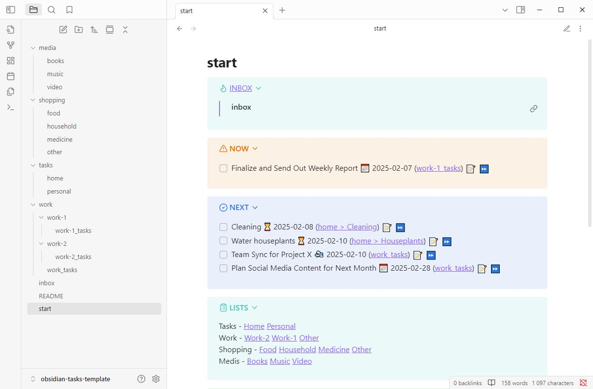
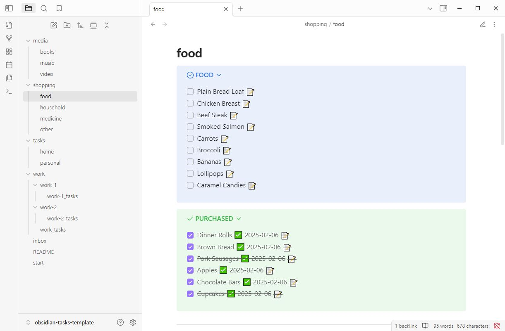

# obsidian-tasks-template
This is an example of how you can organize your work with tasks and shopping lists in Obsidian, if you don't want to use daily notes. Convenient to use on both desktop and mobile devices.

## Screenshots

## Links
**Obsidian:** https://obsidian.md/

**Obsidian Tasks:** https://publish.obsidian.md/tasks/Introduction

## Thank you for using
If you like this template

